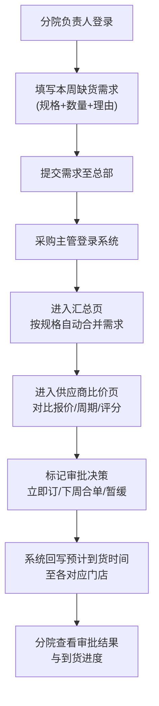

## 1. 产品概述

面向连锁口腔机构（5-30 家门店）的 Web 集中订货台，统一管理多门店向供应商下单流程，解决耗材采购分散、价格不透明、合单效率低的问题。

- **核心目标**：控价、合单降本、审批透明化，实现采购全流程闭环
- **目标用户**：总部采购主管（审批合单）、分院负责人（提交需求）
- **产品价值**：减少重复采购 30%+，降低采购成本 15%+，门店到货时效透明可追溯

---

## 2. 核心功能

### 2.1 用户角色

| 角色 | 登录方式 | 核心权限 |
|------|----------|----------|
| 总部采购主管 | 账号密码（模拟） | 查看所有门店需求、合单合并、供应商比价、审批标记、回写预计到货 |
| 分院负责人 | 账号密码（模拟） | 仅提交/查看本院本周需求、查看审批状态和预计到货时间 |

### 2.2 功能模块

1. **首页总览看板**：按门店卡片展示本周需求概览，统计待审批数、缺货紧急度、合单进度
2. **门店需求提交页**：分院仅可填写本周缺货品（规格+数量+理由），支持草稿保存
3. **需求汇总合并页**：按耗材规格自动聚合同类需求，显示申请门店明细，支持手动合单
4. **供应商比价页**：针对选中耗材并排展示合作供应商的报价、配送周期、最小起订量、历史履约评分
5. **审批决策页**：主管对合并订单标记"立即订/下周合单/暂缓"，系统自动回写给对应门店
6. **门店反馈页**：分院查看本院需求审批结果、预计到货时间、历史订单跟踪

### 2.3 页面详情

| 页面名称 | 模块名称 | 功能描述 |
|----------|----------|----------|
| 首页总览 | 顶部统计条 | 本周需求总数、待审批数、已合单数、暂缓数、采购总金额预估 |
| 首页总览 | 门店卡片网格 | 每个门店卡片：名称、本周需求数、紧急条数、状态标签（未提交/待审/已审）、点击进入详情 |
| 首页总览 | 缺货紧急列表 | 高亮显示标记"紧急"的需求条目（红色背景徽章） |
| 门店需求提交 | 周次选择器 | 默认当前周，分院只能编辑本周的需求 |
| 门店需求提交 | 需求条目表 | 新增/编辑行：耗材名称、规格、数量、紧急程度、理由说明 |
| 门店需求提交 | 快捷模板 | 常用耗材快速添加（儿牙涂氟剂、正畸橡皮圈、藻酸盐等预设） |
| 汇总合并 | 规格分组列表 | 按"耗材名称+规格"自动分组，显示总需求量、申请门店数 |
| 汇总合并 | 合单操作 | 勾选多个规格生成合并采购单，支持编辑最终采购量 |
| 供应商比价 | 并排供应商卡片 | 同一耗材 3-5 家供应商卡片对比：报价/单位、配送周期（天）、MOQ、履约评分（星级）、备注 |
| 供应商比价 | 推荐标记 | 系统自动推荐性价比最高的供应商（绿色"推荐"徽章） |
| 审批决策 | 订单决策面板 | 每条合并单三个按钮：立即订（绿）、下周合单（蓝）、暂缓（灰） |
| 审批决策 | 预计到货回填 | 标记"立即订"后可填写或自动计算预计到货日期（基于配送周期） |
| 门店反馈 | 状态时间线 | 每条需求的状态流转：已提交→已合并→已审批→配送中→已到货 |
| 门店反馈 | 到货提醒 | 高亮显示今日/明日预计到货的条目 |

---

## 3. 核心流程

---

## 4. 用户界面设计

### 4.1 设计风格

- **主色调**：深海蓝 `#1e3a5f`（专业医疗感）搭配青绿色 `#10b981`（采购/健康语义）
- **辅助色**：琥珀橙 `#f59e0b`（紧急预警）、钢灰 `#64748b`（中性信息）
- **按钮风格**：圆角 8px，实心填充，hover 时轻微上浮阴影过渡
- **字体**：标题使用 `Noto Serif SC`（衬线，权威感），正文使用 `Noto Sans SC`（清晰易读）
- **布局风格**：顶部导航栏 + 左侧菜单 + 主内容卡片式布局，大量使用 16px 圆角卡片，柔和阴影
- **图标风格**：Lucide React 线性图标，统一 18-20px 尺寸，颜色跟随语义
- **背景细节**：主背景使用极浅的蓝色渐变（`#f8fafc → #f1f5f9`），卡片 hover 有微发光边框

### 4.2 页面设计概览

| 页面名称 | 模块名称 | UI 元素 |
|----------|----------|---------|
| 首页总览 | 统计条 | 5 个渐变数字卡片，图标+数值+环比箭头，入场淡入上移动画（stagger 0.05s） |
| 首页总览 | 门店卡片 | 9 列网格，卡片左上门店徽章（首字圆形色块），右上状态胶囊标签，底部需求计数条，hover 上移 2px |
| 汇总合并 | 规格分组 | 折叠面板（Accordion），头部显示规格+总需求+门店数，展开后列出各门店申请明细 |
| 供应商比价 | 对比卡片 | 横向 3-4 张并排等高卡片，底部固定"选择此供应商"按钮，推荐卡有青绿色渐变边框光晕 |
| 审批决策 | 决策面板 | 表格行末三按钮组，点击后行背景变色（绿/蓝/灰），出现预计到货日期选择器 |

### 4.3 响应式

- **桌面优先**：主内容区最小宽度 1200px，三栏布局（菜单 240px + 主区 + 侧栏 280px）
- **平板适配**（≥768px）：侧栏改为抽屉式，主区两列堆叠
- **触控优化**：按钮最小 44×44px 可点击区域，表格支持横向滚动

