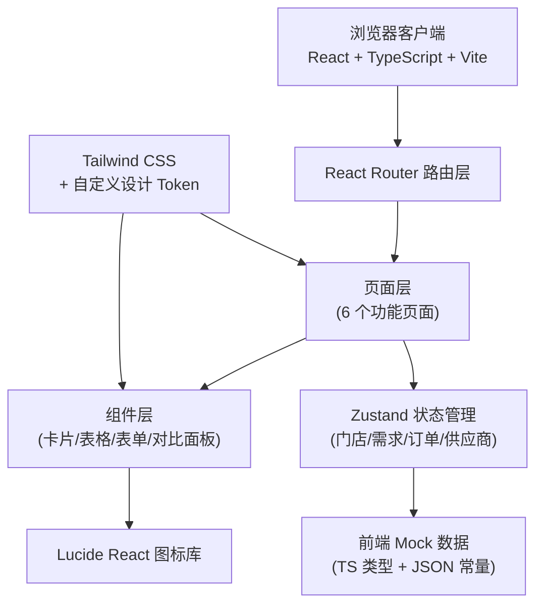
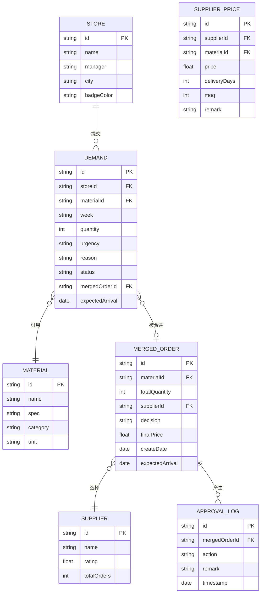

## 1. 架构设计



## 2. 技术描述

- **前端框架**：React@18 + TypeScript@5 + Vite@5
- **样式方案**：Tailwind CSS@3 + 自定义 CSS 变量（设计 Token）
- **路由管理**：React Router DOM@6
- **状态管理**：Zustand@4（轻量无侵入，适合中小型应用）
- **图标库**：Lucide React（线性风格，符合医疗专业感）
- **初始化工具**：vite-init（react-ts 模板，内置 react-router/tailwind/zustand）
- **后端方案**：无后端，全部使用前端 Mock 数据（TS 类型定义 + 常量数据）
- **字体**：Google Fonts - Noto Serif SC + Noto Sans SC
- **数据持久化**：LocalStorage 保存审批操作结果（页面刷新不丢失）

## 3. 路由定义

| 路由路径 | 页面名称 | 访问角色 | 说明 |
|----------|----------|----------|------|
| `/` | 首页总览看板 | 主管/分院 | 按门店展示需求概览、统计数据、紧急缺货 |
| `/submit` | 门店需求提交 | 分院 | 填写本周缺货品（仅允许编辑本周） |
| `/merge` | 需求汇总合并 | 主管 | 按规格自动聚合、勾选合单 |
| `/compare` | 供应商比价 | 主管 | 并排展示供应商报价/周期/评分对比 |
| `/approve` | 审批决策中心 | 主管 | 标记立即订/下周合单/暂缓、回写预计到货 |
| `/feedback` | 门店反馈跟踪 | 分院/主管 | 查看审批结果、预计到货、状态时间线 |

## 4. 数据模型（无后端，纯前端 Mock）

### 4.1 数据模型定义（ER 图）



### 4.2 核心 TypeScript 类型定义

```typescript
// 门店
interface Store {
  id: string;
  name: string;
  manager: string;
  city: string;
  badgeColor: string; // Tailwind 颜色类名
}

// 耗材档案
interface Material {
  id: string;
  name: string;
  spec: string;        // 规格描述，如 "3g/支"
  category: string;    // 分类：儿牙/正畸/修复/消毒
  unit: string;        // 单位：支/盒/卷
}

// 单条需求（门店提交）
type Urgency = 'normal' | 'urgent' | 'critical';
type DemandStatus = 'draft' | 'submitted' | 'merged' | 'approved' | 'delivering' | 'received';

interface Demand {
  id: string;
  storeId: string;
  materialId: string;
  week: string;          // 格式: 2026-W25
  quantity: number;
  urgency: Urgency;
  reason: string;        // 理由，如"低库存"
  status: DemandStatus;
  mergedOrderId?: string;
  expectedArrival?: string; // ISO date
}

// 供应商
interface Supplier {
  id: string;
  name: string;
  rating: number;        // 1-5
  totalOrders: number;   // 历史订单数
}

// 供应商报价（某耗材某供应商）
interface SupplierPrice {
  id: string;
  supplierId: string;
  materialId: string;
  price: number;         // 单价（元）
  deliveryDays: number;  // 配送周期（天）
  moq: number;           // 最小起订量
  remark?: string;
}

// 合并后的采购单
type Decision = 'order_now' | 'next_week' | 'hold' | 'pending';

interface MergedOrder {
  id: string;
  materialId: string;
  demandIds: string[];   // 关联的门店需求
  totalQuantity: number;
  supplierId?: string;
  decision: Decision;
  finalPrice?: number;
  createDate: string;
  expectedArrival?: string;
}
```

## 5. 状态管理设计（Zustand Store）

```typescript
interface ProcurementStore {
  // 原始数据
  stores: Store[];
  materials: Material[];
  demands: Demand[];
  suppliers: Supplier[];
  supplierPrices: SupplierPrice[];
  mergedOrders: MergedOrder[];

  // 当前上下文
  currentRole: 'hq' | 'branch';
  currentStoreId: string | null;
  currentWeek: string;

  // 门店端 Actions
  addDemand: (d: Omit<Demand, 'id' | 'status' | 'week'>) => void;
  updateDemand: (id: string, patch: Partial<Demand>) => void;
  deleteDemand: (id: string) => void;
  submitWeekDemands: () => void;

  // 总部端 Actions
  mergeDemandsBySpec: () => MergedOrder[];
  selectSupplier: (orderId: string, supplierId: string) => void;
  setDecision: (orderId: string, decision: Decision, expectedArrival?: string) => void;

  // 派生 Selectors
  getDemandsByStore: (storeId: string) => Demand[];
  getDemandsByWeek: (week: string) => Demand[];
  getUrgentDemands: () => Demand[];
  getPricesForMaterial: (materialId: string) => SupplierPrice[];
  getStats: () => { total: number; pending: number; merged: number; hold: number; estimatedCost: number };
}
```

## 6. 项目目录结构

```
src/
├── main.tsx                 # 入口，挂载 Router + Store Provider
├── App.tsx                  # 根组件：布局框架 + 路由出口
├── index.css                # Tailwind 引入 + 全局样式 + CSS 变量
├── types/
│   └── index.ts             # 全局 TS 类型（见 4.2）
├── data/
│   ├── stores.ts            # Mock 门店数据（12 家示例）
│   ├── materials.ts         # Mock 耗材档案（20+ SKU）
│   ├── suppliers.ts         # Mock 供应商 + 报价
│   └── demands.ts           # Mock 初始需求数据
├── store/
│   └── useProcurementStore.ts   # Zustand 全局状态
├── components/
│   ├── layout/
│   │   ├── Header.tsx       # 顶部导航栏
│   │   ├── Sidebar.tsx      # 左侧菜单
│   │   └── RoleSwitcher.tsx # 角色切换器（Demo 用）
│   ├── cards/
│   │   ├── StatCard.tsx     # 首页统计卡片
│   │   ├── StoreCard.tsx    # 门店卡片
│   │   ├── SupplierCard.tsx # 供应商比价卡片
│   │   └── MergedOrderCard.tsx
│   ├── tables/
│   │   ├── DemandTable.tsx  # 需求条目表（含编辑）
│   │   └── ApprovalTable.tsx# 审批决策表
│   ├── common/
│   │   ├── Badge.tsx        # 状态徽章
│   │   ├── RatingStars.tsx  # 履约星级
│   │   └── Timeline.tsx     # 状态时间线
│   └── merge/
│       └── SpecGroup.tsx    # 规格分组折叠面板
├── pages/
│   ├── Dashboard.tsx        # 首页总览
│   ├── SubmitDemand.tsx     # 需求提交
│   ├── MergeOrders.tsx      # 汇总合并
│   ├── CompareSuppliers.tsx # 供应商比价
│   ├── ApproveOrders.tsx    # 审批中心
│   └── Feedback.tsx         # 门店反馈
├── utils/
│   ├── week.ts              # 周次计算工具
│   └── date.ts              # 日期格式化工具
└── hooks/
    └── useStats.ts          # 派生数据 Hook
```

